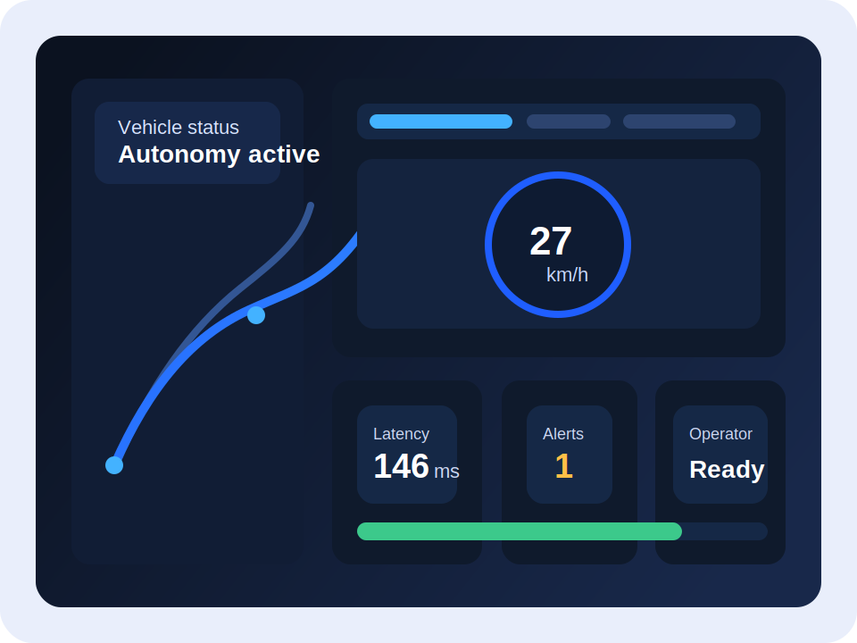
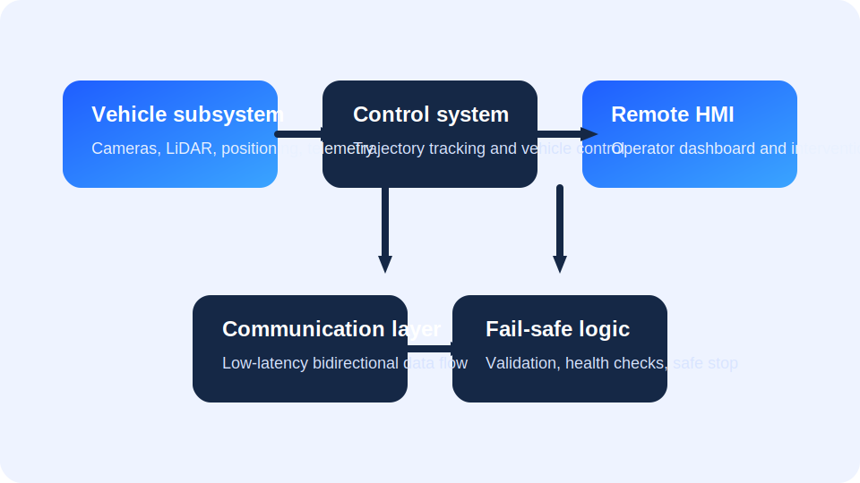

# Static Website Conversion Report

## Executive summary

The uploaded Word document is not a generic essay: it is already a structured business-plan style document about a remote monitoring and emergency intervention system for automated vehicles, with substantial content on market analysis, value proposition, product definition, customer segmentation, TAM/SAM/SOM sizing, cost analysis, risk analysis, SWOT, and a concluding strategic summary. That structure makes it well suited to a multi-page static site rather than a single long landing page. fileciteturn0file0

The best-fit implementation is a zero-build static website: plain HTML, CSS, JavaScript, SVG assets, `robots.txt`, `sitemap.xml`, `README.md`, `.gitignore`, and `vercel.json`, with no `package.json` because the site does not require a build step. That aligns with official deployment guidance for static HTML/CSS/JS on entity["company","Vercel","deployment platform"], where the recommended setup for non-built projects is the `Other` framework preset with the Build Command left empty, and with project-root serving when there is no `public` directory. citeturn9view1turn9view3turn1search0turn1search1

Because no export of the “remote visualisation from the GDP project chats” was accessible in this session, I have treated that request as a design direction rather than a source corpus. Concretely, the project below uses dashboard-style cards, telemetry summaries, architecture visuals, alert callouts, and figure placeholders so the site feels appropriate for a remote-operations product. Where the Word file referenced figures but did not expose reusable image assets, I have marked placeholders clearly.

The recommendation is therefore: **build a multi-page static site, keep the technology stack dependency-free, preserve the document’s chapter structure, and deploy directly from a Git repository to Vercel**. That gives the cleanest information architecture, the best per-page metadata, and the least fragile deployment path. Unique page titles and descriptions also support clearer search snippets, while structured headings and landmarks improve navigation and accessibility. fileciteturn0file0 citeturn4search4turn4search5turn6search4turn6search8

## Template choice

The uploaded document is long, sectional, and table-heavy. That pushes strongly toward a multi-page site rather than a single scroll page or a blog chronology. fileciteturn0file0

| Template | Best use | Pros | Cons | Fit for this Word file |
|---|---|---|---|---|
| Single-page | Short pitch decks, simple product brochure sites | Fastest to build, minimal navigation, easy to scan top-to-bottom | Becomes unwieldy with long tables, weak per-section SEO, anchors become cluttered | Weak |
| Multi-page | Structured reports, business cases, technical overviews | Clear information architecture, unique metadata per page, easier navigation, better handling of long tables and sections | Slightly more navigation and file maintenance | **Strongest** |
| Blog-style | Ongoing updates, dated posts, thought leadership | Good if content is chronological and will keep growing through articles | Artificial for a formal business plan, introduces date bias, weak for fixed report chapters | Weak |

**Recommended choice: multi-page.** The source document already behaves like four natural web chapters: overview/value proposition, business case, product/operations, and strategy/risk. A multi-page structure also makes it easier to give each page a distinct title, canonical URL, and description, which official search guidance recommends where possible. fileciteturn0file0 citeturn4search4turn4search5turn6search4

## Project structure

### Visual folder tree

```text
business-model-site
│   ├── .gitignore
│   ├── 404.html
│   ├── README.md
│   ├── business-case.html
│   ├── index.html
│   ├── product-operations.html
│   ├── robots.txt
│   ├── sitemap.xml
│   ├── strategy.html
│   ├── vercel.json
│   ├── assets
│   │   ├── css
│   │   │   ├── styles.css
│   │   ├── js
│   │   │   ├── main.js
│   │   ├── icons
│   │   │   ├── favicon.svg
│   │   ├── images
│   │   │   ├── hero-dashboard.svg
│   │   │   ├── og-image.svg
│   │   │   ├── system-architecture.svg
```

### File purposes

| File | Purpose |
|---|---|
| `index.html` | Homepage with executive summary, market gap, value proposition, and navigation into the rest of the site |
| `business-case.html` | Competitive landscape, customer segments, TAM/SAM/SOM, revenue assumptions, and limitations |
| `product-operations.html` | Product definition, architecture, feature set, delivery phases, and cost model |
| `strategy.html` | Business model canvas, risk register, SWOT, and strategic summary |
| `404.html` | Clean fallback page for missing routes |
| `assets/css/styles.css` | Entire responsive design system and typography/layout rules |
| `assets/js/main.js` | Mobile navigation toggle and small progressive enhancement helpers |
| `assets/icons/favicon.svg` | Site favicon |
| `assets/images/hero-dashboard.svg` | Dashboard-style hero illustration reflecting remote-visualisation intent |
| `assets/images/system-architecture.svg` | Product architecture block diagram |
| `assets/images/og-image.svg` | Open Graph / social preview asset |
| `robots.txt` | Crawl permissions and sitemap location |
| `sitemap.xml` | URL list for search-engine discovery |
| `vercel.json` | Clean URLs plus response headers in repository-controlled config |
| `README.md` | Setup, preview, and deployment notes |
| `.gitignore` | Ignore local/editor/deployment artefacts |

### Content extracted from the Word file and where it is placed

The Word document did provide enough textual content to populate the main website sections. Specifically, the site below places the document’s content as follows: executive summary, market gap and value proposition on `index.html`; competitor analysis, segment analysis, TAM/SAM/SOM, revenue assumptions and limitations on `business-case.html`; product overview, architecture, operating flow, features and cost model on `product-operations.html`; and business model canvas, risks, SWOT, and conclusion on `strategy.html`. fileciteturn0file0

The remaining placeholders are not “missing content” in the sense of absent copy. They are missing **source assets or publication variables**: the original chart exports, any visual material from the unavailable GDP project chats, the final domain name, author name, repository URL, and any formal bibliography beyond the data-source table already present in the Word document. Those are marked explicitly in the code below.

## Full source code

### Core pages

#### `index.html`

```html
<!DOCTYPE html>
<html lang="en-GB">
  <head>
    <meta charset="utf-8">
    <meta name="viewport" content="width=device-width, initial-scale=1">
    <title>Remote Monitoring and Emergency Intervention System</title>
    <meta name="description" content="Executive summary, market gap, value proposition, and commercial overview for a remote monitoring and emergency intervention system for automated vehicles.">
    <meta name="robots" content="index,follow,max-image-preview:large">
    <meta name="theme-color" content="#0b1220">
    <meta name="author" content="YOUR-NAME-HERE">
    <link rel="canonical" href="https://YOUR-DOMAIN-HERE/">
    <meta property="og:type" content="website">
    <meta property="og:locale" content="en_GB">
    <meta property="og:title" content="Remote Monitoring and Emergency Intervention System">
    <meta property="og:description" content="A static website version of the business model, market case, and product strategy for a hybrid autonomy monitoring platform.">
    <meta property="og:url" content="https://YOUR-DOMAIN-HERE/">
    <meta property="og:image" content="https://YOUR-DOMAIN-HERE/assets/images/og-image.svg">
    <meta name="twitter:card" content="summary_large_image">
    <meta name="twitter:title" content="Remote Monitoring and Emergency Intervention System">
    <meta name="twitter:description" content="Business model, product definition, market sizing, and risk analysis for a hybrid autonomy monitoring platform.">
    <meta name="twitter:image" content="https://YOUR-DOMAIN-HERE/assets/images/og-image.svg">
    <link rel="icon" href="assets/icons/favicon.svg" type="image/svg+xml">
    <link rel="stylesheet" href="assets/css/styles.css">
    <script defer src="assets/js/main.js"></script>
  </head>
  <body>
    <a class="skip-link" href="#main-content">Skip to main content</a>

    <header class="site-header">
      <div class="container">
        <div class="brand-block">
          <a class="brand" href="index.html" aria-label="Go to home page">
            <span class="brand-mark" aria-hidden="true">AV</span>
            <span class="brand-text">Business Model Website</span>
          </a>
          <p class="brand-tagline">Static website conversion of the uploaded Word document</p>
        </div>

        <button class="nav-toggle" type="button" aria-expanded="false" aria-controls="site-nav">
          <span class="sr-only">Toggle navigation</span>
          <span aria-hidden="true">☰</span>
        </button>

        <nav id="site-nav" class="site-nav" aria-label="Primary">
          <ul>
            <li><a href="index.html" aria-current="page">Overview</a></li>
            <li><a href="business-case.html">Business Case</a></li>
            <li><a href="product-operations.html">Product & Operations</a></li>
            <li><a href="strategy.html">Strategy & Risk</a></li>
          </ul>
        </nav>
      </div>
    </header>

    <main id="main-content">
      <section class="hero">
        <div class="container hero-grid">
          <div class="hero-copy">
            <p class="eyebrow">Remote monitoring for controlled autonomous mobility</p>
            <h1>Remote Monitoring and Emergency Intervention System</h1>
            <p class="lede">
              This site turns the uploaded business-model document into a structured, multi-page web presence.
              It presents the market gap, product definition, customer segmentation, financial case, and risk position
              for a hybrid system that combines autonomous vehicle operation with real-time remote supervision and selective intervention.
            </p>

            <div class="stat-grid" aria-label="Key summary metrics">
              <article class="stat-card">
                <h2>Primary beachhead</h2>
                <p>UK university campuses</p>
              </article>
              <article class="stat-card">
                <h2>Quantified TAM</h2>
                <p>364 sites</p>
              </article>
              <article class="stat-card">
                <h2>Three-year SOM</h2>
                <p>7 sites</p>
              </article>
              <article class="stat-card">
                <h2>Estimated development cost</h2>
                <p>£325,000</p>
              </article>
            </div>

            <div class="button-row">
              <a class="button" href="business-case.html">Read the business case</a>
              <a class="button button-secondary" href="product-operations.html">View product details</a>
            </div>
          </div>

          <figure class="hero-figure">
            
            <figcaption>
              Dashboard-style presentation chosen to echo the requested remote-visualisation feel. If GDP project chat visuals become available later, replace this asset with the exported design source.
            </figcaption>
          </figure>
        </div>
      </section>

      <section class="section">
        <div class="container two-column">
          <article>
            <h2>Executive summary</h2>
            <p>
              The proposed product occupies the space between high-cost full-autonomy stacks and teleoperation-heavy systems.
              It is positioned as a lower-cost, hybrid supervision platform for controlled environments such as campuses,
              airports, shuttle corridors, and selected closed sites. In normal operation, the vehicle follows a predefined trajectory autonomously.
              A remote operator monitors the system through a human-machine interface and can intervene in abnormal or safety-critical situations.
            </p>
            <p>
              The document argues that this positioning is commercially attractive because controlled environments are easier to pilot,
              procurement is more centralised, and safety oversight remains a practical requirement even when full-time remote driving is unnecessary.
              The commercial model is site-based rather than passenger-based, using a one-off deployment fee and a recurring annual support fee.
            </p>
          </article>

          <aside class="callout">
            <h2>What this converted website includes</h2>
            <ul class="list-tight">
              <li>Structured navigation across the document's major chapters</li>
              <li>Readable summaries and comparative tables for phones, tablets and desktops</li>
              <li>Semantic HTML landmarks and accessible skip navigation</li>
              <li>Clean URLs ready for static deployment on Vercel</li>
              <li>Clearly labelled placeholders where original figure source files are missing</li>
            </ul>
          </aside>
        </div>
      </section>

      <section class="section section-alt">
        <div class="container">
          <div class="section-heading">
            <p class="eyebrow">Competitive position</p>
            <h2>Market gap identified in the source document</h2>
          </div>

          <div class="grid cards-3">
            <article class="card">
              <h3>Why full autonomy is not the fit</h3>
              <p>
                Advanced autonomy deployments are powerful but complex, capital intensive, and difficult to justify for small fleets in controlled routes.
              </p>
            </article>
            <article class="card">
              <h3>Why full teleoperation is not the fit</h3>
              <p>
                Continuous human driving raises operating cost, bandwidth dependence, and integration complexity when full-time remote steering is not needed.
              </p>
            </article>
            <article class="card">
              <h3>Where the project fits</h3>
              <p>
                A lightweight supervision layer with emergency intervention gives safety cover, keeps the autonomy stack leaner, and remains practical for campus-scale operations.
              </p>
            </article>
          </div>

          <div class="comparison-panel">
            <div>
              <h3>Comparative summary from the document</h3>
              <p>
                Teleoperation providers such as Phantom Auto, Ottopia and Vay offer strong remote-control capability but are characterised in the document as high-cost and operationally heavy.
                Ohmio and Oxa better match controlled environments but are described as comparatively weak in real-time intervention.
                Waymo demonstrates the outer edge of autonomy capability, yet the document treats it as commercially unsuitable for the target use case.
              </p>
            </div>
            <a class="text-link" href="business-case.html#competitive-landscape">Open the full comparison table</a>
          </div>
        </div>
      </section>

      <section class="section">
        <div class="container">
          <div class="section-heading">
            <p class="eyebrow">Value proposition</p>
            <h2>Core value delivered by the proposed system</h2>
          </div>

          <div class="grid cards-5">
            <article class="mini-card">
              <h3>Cost-effective deployment</h3>
              <p>Lower infrastructure and operating burden than continuous teleoperation.</p>
            </article>
            <article class="mini-card">
              <h3>Remote safety intervention</h3>
              <p>Emergency braking and selective override support abnormal-event management.</p>
            </article>
            <article class="mini-card">
              <h3>Reduced complexity</h3>
              <p>No requirement for full-time remote driving in day-to-day operation.</p>
            </article>
            <article class="mini-card">
              <h3>Controlled-environment fit</h3>
              <p>Designed for campuses, shuttles, research sites and low-speed routes.</p>
            </article>
            <article class="mini-card">
              <h3>Hybrid architecture</h3>
              <p>Balances autonomous control, remote monitoring, and human intervention.</p>
            </article>
          </div>
        </div>
      </section>

      <section class="section section-alt">
        <div class="container">
          <div class="section-heading">
            <p class="eyebrow">Page map</p>
            <h2>How the rest of the website is organised</h2>
          </div>

          <div class="grid cards-3">
            <article class="card card-link">
              <h3><a href="business-case.html">Business Case</a></h3>
              <p>Competitive landscape, target segments, TAM/SAM/SOM logic, revenue assumptions, and supporting data sources.</p>
            </article>
            <article class="card card-link">
              <h3><a href="product-operations.html">Product & Operations</a></h3>
              <p>System overview, architecture, features, workflow, team structure, development schedule, and cost model.</p>
            </article>
            <article class="card card-link">
              <h3><a href="strategy.html">Strategy & Risk</a></h3>
              <p>Business model canvas, structured risk analysis, SWOT summary, and final strategic conclusion.</p>
            </article>
          </div>
        </div>
      </section>

      <section class="section">
        <div class="container">
          <figure class="figure-placeholder">
            <div class="placeholder-box">
              <strong>Placeholder for extracted source figures</strong>
              <p>
                The Word document references enrolment and salary charts, but the accessible export did not include usable source images.
                Replace this block with the original figure exports if they are available later.
              </p>
            </div>
            <figcaption>Recommended insertion point for original charts from the source document.</figcaption>
          </figure>
        </div>
      </section>
    </main>

    <footer class="site-footer">
      <div class="container footer-grid">
        <div>
          <h2>Business Model Website</h2>
          <p>
            Static HTML, CSS and JavaScript build intended for GitHub upload and Vercel deployment.
          </p>
        </div>

        <div>
          <h2>Pages</h2>
          <ul class="list-plain">
            <li><a href="index.html">Overview</a></li>
            <li><a href="business-case.html">Business Case</a></li>
            <li><a href="product-operations.html">Product & Operations</a></li>
            <li><a href="strategy.html">Strategy & Risk</a></li>
          </ul>
        </div>

        <div>
          <h2>Project notes</h2>
          <p>
            Replace domain, author, social preview, and missing-figure placeholders before going live.
          </p>
          <p class="footer-meta">© <span data-year></span> YOUR-NAME-HERE</p>
        </div>
      </div>
    </footer>
  </body>
</html>
```

#### `business-case.html`

```html
<!DOCTYPE html>
<html lang="en-GB">
  <head>
    <meta charset="utf-8">
    <meta name="viewport" content="width=device-width, initial-scale=1">
    <title>Business Case and Market Analysis</title>
    <meta name="description" content="Competitive comparison, market gap, customer segmentation, TAM/SAM/SOM sizing, and revenue assumptions for the remote monitoring platform.">
    <meta name="robots" content="index,follow,max-image-preview:large">
    <meta name="theme-color" content="#0b1220">
    <meta name="author" content="YOUR-NAME-HERE">
    <link rel="canonical" href="https://YOUR-DOMAIN-HERE/business-case">
    <meta property="og:type" content="website">
    <meta property="og:locale" content="en_GB">
    <meta property="og:title" content="Business Case and Market Analysis">
    <meta property="og:description" content="Competitive positioning and market sizing for the hybrid autonomy supervision platform.">
    <meta property="og:url" content="https://YOUR-DOMAIN-HERE/business-case">
    <meta property="og:image" content="https://YOUR-DOMAIN-HERE/assets/images/og-image.svg">
    <meta name="twitter:card" content="summary_large_image">
    <meta name="twitter:title" content="Business Case and Market Analysis">
    <meta name="twitter:description" content="Competitive landscape, market segmentation and revenue model.">
    <meta name="twitter:image" content="https://YOUR-DOMAIN-HERE/assets/images/og-image.svg">
    <link rel="icon" href="assets/icons/favicon.svg" type="image/svg+xml">
    <link rel="stylesheet" href="assets/css/styles.css">
    <script defer src="assets/js/main.js"></script>
  </head>
  <body>
    <a class="skip-link" href="#main-content">Skip to main content</a>

    <header class="site-header">
      <div class="container">
        <div class="brand-block">
          <a class="brand" href="index.html" aria-label="Go to home page">
            <span class="brand-mark" aria-hidden="true">AV</span>
            <span class="brand-text">Business Model Website</span>
          </a>
          <p class="brand-tagline">Static website conversion of the uploaded Word document</p>
        </div>

        <button class="nav-toggle" type="button" aria-expanded="false" aria-controls="site-nav">
          <span class="sr-only">Toggle navigation</span>
          <span aria-hidden="true">☰</span>
        </button>

        <nav id="site-nav" class="site-nav" aria-label="Primary">
          <ul>
            <li><a href="index.html">Overview</a></li>
            <li><a href="business-case.html" aria-current="page">Business Case</a></li>
            <li><a href="product-operations.html">Product & Operations</a></li>
            <li><a href="strategy.html">Strategy & Risk</a></li>
          </ul>
        </nav>
      </div>
    </header>

    <main id="main-content">
      <section class="page-hero">
        <div class="container">
          <p class="eyebrow">Business case</p>
          <h1>Market analysis, customer focus and commercial sizing</h1>
          <p class="lede">
            This page covers the document's external market view: competitor comparison, identified market gap,
            value proposition, market segmentation, commercial sizing, and revenue assumptions.
          </p>
        </div>
      </section>

      <section class="section" id="competitive-landscape">
        <div class="container">
          <div class="section-heading">
            <p class="eyebrow">Competitive landscape</p>
            <h2>Comparative market analysis</h2>
            <p>
              The original document compares full autonomy providers, teleoperation platforms, and controlled-environment
              automation stacks to show where a hybrid remote-monitoring system can differentiate.
            </p>
          </div>

          <div class="table-scroll" tabindex="0" aria-label="Competitive comparison table">
            <table>
              <caption>Selected competitor comparison from the source document</caption>
              <thead>
                <tr>
                  <th scope="col">Company</th>
                  <th scope="col">Core focus</th>
                  <th scope="col">Remote capability</th>
                  <th scope="col">Key strength</th>
                  <th scope="col">Key limitation</th>
                  <th scope="col">Differentiation opportunity</th>
                </tr>
              </thead>
              <tbody>
                <tr>
                  <th scope="row">Phantom Auto</th>
                  <td>Teleoperation for logistics</td>
                  <td>Full teleoperation</td>
                  <td>Mature teleoperation platform</td>
                  <td>High cost, industrial focus, shutdown risk</td>
                  <td>Lightweight, lower-cost monitoring for smaller fleets</td>
                </tr>
                <tr>
                  <th scope="row">Ottopia</th>
                  <td>Teleoperation platform</td>
                  <td>Full and assisted control</td>
                  <td>Safety-focused scalable tele-assistance</td>
                  <td>Complex and infrastructure-heavy</td>
                  <td>Simpler cost-effective intervention system</td>
                </tr>
                <tr>
                  <th scope="row">Vay</th>
                  <td>Remote driving service</td>
                  <td>Full tele-driving</td>
                  <td>Real-world remote driving deployment</td>
                  <td>Human-driver dependence and latency sensitivity</td>
                  <td>Hybrid model with autonomy by default and override only when needed</td>
                </tr>
                <tr>
                  <th scope="row">Ohmio</th>
                  <td>Autonomous shuttle</td>
                  <td>Monitoring only</td>
                  <td>Strong deployment in controlled environments</td>
                  <td>Limited remote intervention capability</td>
                  <td>Add remote control and emergency braking layer</td>
                </tr>
                <tr>
                  <th scope="row">Oxa</th>
                  <td>Autonomous driving software</td>
                  <td>Monitoring with limited intervention</td>
                  <td>Scalable autonomy platform with UK relevance</td>
                  <td>No teleoperation layer, high system complexity</td>
                  <td>Add real-time remote intervention layer</td>
                </tr>
                <tr>
                  <th scope="row">Waymo</th>
                  <td>Robotaxi autonomy</td>
                  <td>Remote assistance only</td>
                  <td>Industry-leading autonomous deployment</td>
                  <td>Very high cost and high complexity</td>
                  <td>Focus instead on smaller, lower-cost controlled deployments</td>
                </tr>
              </tbody>
            </table>
          </div>

          <p class="note">
            Editorial note: the source document frames these companies as comparison points only. This site repeats the analysis provided in the uploaded document and does not add fresh third-party market judgement inside the website content itself.
          </p>
        </div>
      </section>

      <section class="section section-alt">
        <div class="container two-column">
          <article>
            <h2>Market gap analysis</h2>
            <p>
              The source document identifies a gap between two extremes. At one end are technologically advanced but very expensive autonomy platforms.
              At the other are teleoperation systems that provide safety and flexibility but depend on continuous human operation, higher bandwidth,
              and more complex integration.
            </p>
            <p>
              Controlled-environment providers fit the operating context better, but the document argues that they often stop at autonomy plus monitoring,
              without offering a robust real-time intervention layer. The proposed product therefore aims to bridge the gap with a hybrid model:
              autonomy first, remote supervision always, intervention on demand.
            </p>
          </article>

          <aside class="callout">
            <h2>Final value proposition statement</h2>
            <p>
              The system is presented as a cost-effective hybrid solution integrating autonomous vehicle operation with real-time remote monitoring and
              emergency intervention, specifically for controlled environments such as campus mobility.
            </p>
          </aside>
        </div>
      </section>

      <section class="section">
        <div class="container">
          <div class="section-heading">
            <p class="eyebrow">Customer analysis</p>
            <h2>Priority market segments</h2>
          </div>

          <div class="grid cards-4">
            <article class="card">
              <h3>University campuses</h3>
              <p>Primary beachhead. Defined road networks, low-speed operations, high pedestrian interaction, and centralised procurement.</p>
            </article>
            <article class="card">
              <h3>Airports</h3>
              <p>Secondary segment. Highly controlled, safety critical, and commercially attractive, but with slower cycles and more regulation.</p>
            </article>
            <article class="card">
              <h3>Shuttle corridors and business parks</h3>
              <p>Expansion segment. Promising fit for structured routes, though projects can be more fragmented and partner-dependent.</p>
            </article>
            <article class="card">
              <h3>Closed-site operators</h3>
              <p>Selective segment. Useful for some industrial environments, but less aligned with the product's passenger-mobility focus.</p>
            </article>
          </div>

          <div class="table-scroll" tabindex="0" aria-label="Segment comparison table">
            <table>
              <caption>Market segment comparison summary</caption>
              <thead>
                <tr>
                  <th scope="col">Criteria</th>
                  <th scope="col">University campuses</th>
                  <th scope="col">Airports</th>
                  <th scope="col">Shuttle corridors / business parks</th>
                  <th scope="col">Closed-site operators</th>
                </tr>
              </thead>
              <tbody>
                <tr>
                  <th scope="row">Deployment feasibility</th>
                  <td>High</td>
                  <td>Moderate</td>
                  <td>Moderate</td>
                  <td>High</td>
                </tr>
                <tr>
                  <th scope="row">Regulatory complexity</th>
                  <td>Low</td>
                  <td>Very high</td>
                  <td>Moderate</td>
                  <td>Low</td>
                </tr>
                <tr>
                  <th scope="row">Need for remote intervention</th>
                  <td>High</td>
                  <td>Very high</td>
                  <td>Moderate to high</td>
                  <td>Moderate</td>
                </tr>
                <tr>
                  <th scope="row">Typical fleet size</th>
                  <td>1–5 vehicles</td>
                  <td>3–10 vehicles</td>
                  <td>3–8 vehicles</td>
                  <td>5–20 vehicles</td>
                </tr>
                <tr>
                  <th scope="row">Strategic priority</th>
                  <td>Primary</td>
                  <td>Secondary</td>
                  <td>Expansion</td>
                  <td>Selective</td>
                </tr>
              </tbody>
            </table>
          </div>
        </div>
      </section>

      <section class="section section-alt">
        <div class="container">
          <div class="section-heading">
            <p class="eyebrow">Market sizing</p>
            <h2>TAM, SAM and SOM</h2>
            <p>
              The document sizes the market on a per-site basis rather than per passenger or per vehicle.
              The commercial question is therefore how many UK sites could realistically deploy a remote monitoring and emergency intervention system.
            </p>
          </div>

          <div class="grid cards-3">
            <article class="metric-panel">
              <h3>TAM</h3>
              <p class="metric-number">364</p>
              <p>304 campuses + 60 airports</p>
            </article>
            <article class="metric-panel">
              <h3>SAM</h3>
              <p class="metric-number">91</p>
              <p>76 campuses + 15 airports after 25% filtering</p>
            </article>
            <article class="metric-panel">
              <h3>SOM</h3>
              <p class="metric-number">7</p>
              <p>Three-year obtainable target: 5 campuses + 2 airports</p>
            </article>
          </div>

          <div class="grid cards-2">
            <article class="card">
              <h3>Revenue assumptions per site</h3>
              <ul class="list-tight">
                <li>One-off deployment / integration fee: £75,000</li>
                <li>Annual software, monitoring and support fee: £60,000</li>
                <li>First-year value per site: £135,000</li>
              </ul>
            </article>

            <article class="card">
              <h3>Revenue view from the source model</h3>
              <ul class="list-tight">
                <li>TAM annual recurring revenue: £21.84m</li>
                <li>SAM annual recurring revenue: £5.46m</li>
                <li>SOM annual recurring revenue: £0.42m</li>
                <li>TAM first-year value: £49.14m</li>
                <li>SAM first-year value: £12.285m</li>
                <li>SOM first-year value: £0.945m</li>
              </ul>
            </article>
          </div>

          <div class="table-scroll" tabindex="0" aria-label="Detailed market sizing table">
            <table>
              <caption>Detailed sizing table</caption>
              <thead>
                <tr>
                  <th scope="col">Metric</th>
                  <th scope="col">Campuses</th>
                  <th scope="col">Airports</th>
                  <th scope="col">Total</th>
                </tr>
              </thead>
              <tbody>
                <tr>
                  <th scope="row">Quantified TAM sites</th>
                  <td>304</td>
                  <td>60</td>
                  <td>364</td>
                </tr>
                <tr>
                  <th scope="row">SAM filter</th>
                  <td>25%</td>
                  <td>25%</td>
                  <td>—</td>
                </tr>
                <tr>
                  <th scope="row">Quantified SAM sites</th>
                  <td>76</td>
                  <td>15</td>
                  <td>91</td>
                </tr>
                <tr>
                  <th scope="row">SOM</th>
                  <td>5</td>
                  <td>2</td>
                  <td>7</td>
                </tr>
              </tbody>
            </table>
          </div>
        </div>
      </section>

      <section class="section">
        <div class="container two-column">
          <article>
            <h2>Data sources listed in the document</h2>
            <ul class="list-tight">
              <li>Higher Education Statistics Agency for UK higher-education data</li>
              <li>UK Civil Aviation Authority for airport and aviation data</li>
              <li>UK Government policy material on automated vehicles</li>
              <li>Oxa deployment examples for controlled-environment automation</li>
              <li>Office for National Statistics for labour-cost benchmarks</li>
              <li>Amazon Web Services for indicative cloud pricing assumptions</li>
              <li>Vodafone for connectivity solution assumptions</li>
            </ul>
          </article>

          <aside class="callout">
            <h2>Limitations explicitly noted in the document</h2>
            <ul class="list-tight">
              <li>Competitor pricing is not publicly disclosed in a directly comparable way</li>
              <li>Adoption rates are estimated conservatively</li>
              <li>Regulatory developments may alter deployment speed</li>
              <li>Expansion beyond campuses and airports is not fully quantified</li>
            </ul>
          </aside>
        </div>
      </section>
    </main>

    <footer class="site-footer">
      <div class="container footer-grid">
        <div>
          <h2>Business Model Website</h2>
          <p>Static HTML, CSS and JavaScript build intended for GitHub upload and Vercel deployment.</p>
        </div>

        <div>
          <h2>Pages</h2>
          <ul class="list-plain">
            <li><a href="index.html">Overview</a></li>
            <li><a href="business-case.html">Business Case</a></li>
            <li><a href="product-operations.html">Product & Operations</a></li>
            <li><a href="strategy.html">Strategy & Risk</a></li>
          </ul>
        </div>

        <div>
          <h2>Project notes</h2>
          <p>Replace domain, author, social preview, and missing-figure placeholders before going live.</p>
          <p class="footer-meta">© <span data-year></span> YOUR-NAME-HERE</p>
        </div>
      </div>
    </footer>
  </body>
</html>
```

#### `product-operations.html`

```html
<!DOCTYPE html>
<html lang="en-GB">
  <head>
    <meta charset="utf-8">
    <meta name="viewport" content="width=device-width, initial-scale=1">
    <title>Product Definition and Operations</title>
    <meta name="description" content="System overview, architecture, operating concept, features, team structure, development phases, and product cost model.">
    <meta name="robots" content="index,follow,max-image-preview:large">
    <meta name="theme-color" content="#0b1220">
    <meta name="author" content="YOUR-NAME-HERE">
    <link rel="canonical" href="https://YOUR-DOMAIN-HERE/product-operations">
    <meta property="og:type" content="website">
    <meta property="og:locale" content="en_GB">
    <meta property="og:title" content="Product Definition and Operations">
    <meta property="og:description" content="Architecture, operating model and cost basis for the remote monitoring system.">
    <meta property="og:url" content="https://YOUR-DOMAIN-HERE/product-operations">
    <meta property="og:image" content="https://YOUR-DOMAIN-HERE/assets/images/og-image.svg">
    <meta name="twitter:card" content="summary_large_image">
    <meta name="twitter:title" content="Product Definition and Operations">
    <meta name="twitter:description" content="Architecture, features, team structure and development cost model.">
    <meta name="twitter:image" content="https://YOUR-DOMAIN-HERE/assets/images/og-image.svg">
    <link rel="icon" href="assets/icons/favicon.svg" type="image/svg+xml">
    <link rel="stylesheet" href="assets/css/styles.css">
    <script defer src="assets/js/main.js"></script>
  </head>
  <body>
    <a class="skip-link" href="#main-content">Skip to main content</a>

    <header class="site-header">
      <div class="container">
        <div class="brand-block">
          <a class="brand" href="index.html" aria-label="Go to home page">
            <span class="brand-mark" aria-hidden="true">AV</span>
            <span class="brand-text">Business Model Website</span>
          </a>
          <p class="brand-tagline">Static website conversion of the uploaded Word document</p>
        </div>

        <button class="nav-toggle" type="button" aria-expanded="false" aria-controls="site-nav">
          <span class="sr-only">Toggle navigation</span>
          <span aria-hidden="true">☰</span>
        </button>

        <nav id="site-nav" class="site-nav" aria-label="Primary">
          <ul>
            <li><a href="index.html">Overview</a></li>
            <li><a href="business-case.html">Business Case</a></li>
            <li><a href="product-operations.html" aria-current="page">Product & Operations</a></li>
            <li><a href="strategy.html">Strategy & Risk</a></li>
          </ul>
        </nav>
      </div>
    </header>

    <main id="main-content">
      <section class="page-hero">
        <div class="container">
          <p class="eyebrow">Product and operations</p>
          <h1>System architecture, feature set and delivery cost</h1>
          <p class="lede">
            This page reworks the source document's product-definition and costing chapters into a web-native format.
          </p>
        </div>
      </section>

      <section class="section">
        <div class="container two-column">
          <article>
            <h2>Product overview</h2>
            <p>
              The proposed product is a real-time remote monitoring and emergency control system for automated vehicles.
              It is intended to improve safety, reliability and operational efficiency in controlled environments by combining
              autonomous trajectory tracking with remote supervision.
            </p>
            <p>
              The product is framed as an intermediate architecture. Vehicles operate autonomously under normal conditions,
              while a remote operator can monitor state, review perception inputs and intervene in abnormal scenarios.
            </p>
          </article>

          <aside class="callout">
            <h2>Product positioning</h2>
            <p>
              Lightweight, cost-effective and designed for campuses, business parks, low-speed routes and other controlled environments where
              full continuous teleoperation is unnecessary but safety oversight remains important.
            </p>
          </aside>
        </div>
      </section>

      <section class="section section-alt">
        <div class="container">
          <div class="section-heading">
            <p class="eyebrow">System architecture</p>
            <h2>Four major subsystems</h2>
          </div>

          <figure class="architecture-figure">
            
            <figcaption>Simplified architecture drawn from the source document's subsystem description.</figcaption>
          </figure>

          <div class="grid cards-4">
            <article class="card">
              <h3>Vehicle subsystem</h3>
              <p>Includes cameras, LiDAR, localisation hardware and onboard data generation for position, speed and scene perception.</p>
            </article>
            <article class="card">
              <h3>Control system</h3>
              <p>Implements longitudinal and lateral control to maintain accurate trajectory tracking and stable behaviour.</p>
            </article>
            <article class="card">
              <h3>Remote monitoring interface</h3>
              <p>Human-machine interface for vehicle state, camera feeds, trajectory information, alerts and intervention controls.</p>
            </article>
            <article class="card">
              <h3>Communication layer</h3>
              <p>Bidirectional low-latency data flow between the vehicle and the operator, with validation and consistency checks.</p>
            </article>
          </div>
        </div>
      </section>

      <section class="section">
        <div class="container">
          <div class="section-heading">
            <p class="eyebrow">Operating concept</p>
            <h2>How the system is intended to work</h2>
          </div>

          <ol class="flow-list">
            <li>Sensor data is collected and processed onboard the vehicle.</li>
            <li>The control system maintains trajectory tracking.</li>
            <li>Vehicle and sensor state are transmitted to the remote operator interface.</li>
            <li>The operator supervises performance in real time.</li>
            <li>If an anomaly occurs, the operator can intervene through emergency braking or override commands.</li>
          </ol>

          <div class="grid cards-3">
            <article class="card">
              <h3>Normal mode</h3>
              <p>Autonomous trajectory following on predefined routes.</p>
            </article>
            <article class="card">
              <h3>Supervision mode</h3>
              <p>Human-in-the-loop oversight through a remote HMI and live data feeds.</p>
            </article>
            <article class="card">
              <h3>Intervention mode</h3>
              <p>Selective remote action in safety-critical or abnormal conditions.</p>
            </article>
          </div>
        </div>
      </section>

      <section class="section section-alt">
        <div class="container">
          <div class="section-heading">
            <p class="eyebrow">Functional requirements</p>
            <h2>Core, safety and communication features</h2>
          </div>

          <div class="grid cards-3">
            <article class="card">
              <h3>Core functional features</h3>
              <ul class="list-tight">
                <li>Trajectory tracking with longitudinal and lateral control</li>
                <li>Real-time monitoring of vehicle and sensor data</li>
                <li>Remote supervision through a dedicated HMI</li>
              </ul>
            </article>
            <article class="card">
              <h3>Safety features</h3>
              <ul class="list-tight">
                <li>Emergency braking available to the operator</li>
                <li>Fail-safe mechanisms for communication or control failure</li>
                <li>Redundancy checks to improve integrity and reliability</li>
              </ul>
            </article>
            <article class="card">
              <h3>Communication features</h3>
              <ul class="list-tight">
                <li>Low-latency streaming with a target below 200 ms</li>
                <li>Bidirectional communication for control and feedback</li>
                <li>Data integrity checks to reduce information loss</li>
              </ul>
            </article>
          </div>
        </div>
      </section>

      <section class="section">
        <div class="container">
          <div class="section-heading">
            <p class="eyebrow">Development basis</p>
            <h2>Team structure and duration</h2>
          </div>

          <div class="table-scroll" tabindex="0" aria-label="Development team structure table">
            <table>
              <caption>Proposed development team</caption>
              <thead>
                <tr>
                  <th scope="col">Role</th>
                  <th scope="col">Number of engineers</th>
                  <th scope="col">Primary responsibility</th>
                </tr>
              </thead>
              <tbody>
                <tr>
                  <th scope="row">Software engineers</th>
                  <td>2</td>
                  <td>Backend logic, communication stack, system integration</td>
                </tr>
                <tr>
                  <th scope="row">Control engineer</th>
                  <td>1</td>
                  <td>Trajectory tracking, control algorithms, vehicle interface</td>
                </tr>
                <tr>
                  <th scope="row">HMI engineer</th>
                  <td>1</td>
                  <td>Monitoring dashboard and operator interface</td>
                </tr>
                <tr>
                  <th scope="row">Systems integration engineer</th>
                  <td>1</td>
                  <td>Hardware-software integration and sensor interfacing</td>
                </tr>
                <tr>
                  <th scope="row">Test and validation engineer</th>
                  <td>1</td>
                  <td>Testing, debugging and validation scenarios</td>
                </tr>
              </tbody>
            </table>
          </div>

          <div class="grid cards-4">
            <article class="mini-card">
              <h3>Phase 1</h3>
              <p>Prototype development — 2 months</p>
            </article>
            <article class="mini-card">
              <h3>Phase 2</h3>
              <p>System integration — 2 months</p>
            </article>
            <article class="mini-card">
              <h3>Phase 3</h3>
              <p>Testing and validation — 2 months</p>
            </article>
            <article class="mini-card">
              <h3>Phase 4</h3>
              <p>Deployment preparation — 1 month</p>
            </article>
          </div>
        </div>
      </section>

      <section class="section section-alt">
        <div class="container">
          <div class="section-heading">
            <p class="eyebrow">Cost model</p>
            <h2>Estimated product development cost</h2>
          </div>

          <div class="grid cards-2">
            <article class="card">
              <h3>Personnel cost</h3>
              <p>The document estimates total personnel cost for seven months at approximately £237,000.</p>
            </article>
            <article class="card">
              <h3>Software infrastructure</h3>
              <p>Cloud compute, storage, monitoring and development tools are grouped at approximately £5,000.</p>
            </article>
            <article class="card">
              <h3>Testing and validation</h3>
              <p>Field testing, simulation, data analysis, debugging and deployment preparation total approximately £17,000.</p>
            </article>
            <article class="card">
              <h3>Hardware and prototype cost</h3>
              <p>Rounded to £36,000 in the final total, based on line items covering cameras, LiDAR, GNSS/INS, onboard compute, drive-by-wire and networking.</p>
            </article>
          </div>

          <div class="table-scroll" tabindex="0" aria-label="Development cost summary table">
            <table>
              <caption>Development cost summary used on this website</caption>
              <thead>
                <tr>
                  <th scope="col">Cost component</th>
                  <th scope="col">Value</th>
                </tr>
              </thead>
              <tbody>
                <tr>
                  <th scope="row">Personnel cost</th>
                  <td>£237,000</td>
                </tr>
                <tr>
                  <th scope="row">Hardware and prototype cost</th>
                  <td>£36,000</td>
                </tr>
                <tr>
                  <th scope="row">Software infrastructure cost</th>
                  <td>£5,000</td>
                </tr>
                <tr>
                  <th scope="row">Testing and validation cost</th>
                  <td>£17,000</td>
                </tr>
                <tr>
                  <th scope="row">Subtotal</th>
                  <td>£295,000</td>
                </tr>
                <tr>
                  <th scope="row">10% allowance</th>
                  <td>£29,500</td>
                </tr>
                <tr>
                  <th scope="row">Total development cost</th>
                  <td>£324,500 (rounded to £325,000)</td>
                </tr>
              </tbody>
            </table>
          </div>

          <p class="note">
            Quality-control note: the source document contains an internal inconsistency in the hardware section, where line items total £35,900 and the final summary rounds to £36,000, but one intermediate line says “≈ £26,000”.
            This website uses the rounded £36,000 figure, because it aligns with the stated line-item total and the final overall development-cost table.
          </p>
        </div>
      </section>

      <section class="section">
        <div class="container">
          <figure class="figure-placeholder">
            <div class="placeholder-box">
              <strong>Placeholder for source hardware imagery</strong>
              <p>
                Optional insertion point for actual product photographs, HMI screenshots, or remote visualisation mock-ups if they become available later.
              </p>
            </div>
            <figcaption>Recommended asset replacement area for richer product visuals.</figcaption>
          </figure>
        </div>
      </section>
    </main>

    <footer class="site-footer">
      <div class="container footer-grid">
        <div>
          <h2>Business Model Website</h2>
          <p>Static HTML, CSS and JavaScript build intended for GitHub upload and Vercel deployment.</p>
        </div>

        <div>
          <h2>Pages</h2>
          <ul class="list-plain">
            <li><a href="index.html">Overview</a></li>
            <li><a href="business-case.html">Business Case</a></li>
            <li><a href="product-operations.html">Product & Operations</a></li>
            <li><a href="strategy.html">Strategy & Risk</a></li>
          </ul>
        </div>

        <div>
          <h2>Project notes</h2>
          <p>Replace domain, author, social preview, and missing-figure placeholders before going live.</p>
          <p class="footer-meta">© <span data-year></span> YOUR-NAME-HERE</p>
        </div>
      </div>
    </footer>
  </body>
</html>
```

#### `strategy.html`

```html
<!DOCTYPE html>
<html lang="en-GB">
  <head>
    <meta charset="utf-8">
    <meta name="viewport" content="width=device-width, initial-scale=1">
    <title>Strategy, Risk and SWOT</title>
    <meta name="description" content="Business model canvas, principal risks, mitigation strategies, SWOT analysis and strategic conclusion.">
    <meta name="robots" content="index,follow,max-image-preview:large">
    <meta name="theme-color" content="#0b1220">
    <meta name="author" content="YOUR-NAME-HERE">
    <link rel="canonical" href="https://YOUR-DOMAIN-HERE/strategy">
    <meta property="og:type" content="website">
    <meta property="og:locale" content="en_GB">
    <meta property="og:title" content="Strategy, Risk and SWOT">
    <meta property="og:description" content="Business model canvas, risk analysis and strategic conclusion for the hybrid autonomy supervision platform.">
    <meta property="og:url" content="https://YOUR-DOMAIN-HERE/strategy">
    <meta property="og:image" content="https://YOUR-DOMAIN-HERE/assets/images/og-image.svg">
    <meta name="twitter:card" content="summary_large_image">
    <meta name="twitter:title" content="Strategy, Risk and SWOT">
    <meta name="twitter:description" content="Risk register, SWOT and strategic summary for deployment-focused AV supervision.">
    <meta name="twitter:image" content="https://YOUR-DOMAIN-HERE/assets/images/og-image.svg">
    <link rel="icon" href="assets/icons/favicon.svg" type="image/svg+xml">
    <link rel="stylesheet" href="assets/css/styles.css">
    <script defer src="assets/js/main.js"></script>
  </head>
  <body>
    <a class="skip-link" href="#main-content">Skip to main content</a>

    <header class="site-header">
      <div class="container">
        <div class="brand-block">
          <a class="brand" href="index.html" aria-label="Go to home page">
            <span class="brand-mark" aria-hidden="true">AV</span>
            <span class="brand-text">Business Model Website</span>
          </a>
          <p class="brand-tagline">Static website conversion of the uploaded Word document</p>
        </div>

        <button class="nav-toggle" type="button" aria-expanded="false" aria-controls="site-nav">
          <span class="sr-only">Toggle navigation</span>
          <span aria-hidden="true">☰</span>
        </button>

        <nav id="site-nav" class="site-nav" aria-label="Primary">
          <ul>
            <li><a href="index.html">Overview</a></li>
            <li><a href="business-case.html">Business Case</a></li>
            <li><a href="product-operations.html">Product & Operations</a></li>
            <li><a href="strategy.html" aria-current="page">Strategy & Risk</a></li>
          </ul>
        </nav>
      </div>
    </header>

    <main id="main-content">
      <section class="page-hero">
        <div class="container">
          <p class="eyebrow">Strategy and risk</p>
          <h1>Business model canvas, risks and strategic conclusion</h1>
          <p class="lede">
            This page presents the document's commercial logic, principal risk areas, SWOT summary and final strategic assessment.
          </p>
        </div>
      </section>

      <section class="section">
        <div class="container">
          <div class="section-heading">
            <p class="eyebrow">Business model canvas</p>
            <h2>Commercial structure at a glance</h2>
          </div>

          <div class="grid cards-4">
            <article class="card">
              <h3>Customer segments</h3>
              <p>Primary: UK university campuses. Secondary: airports and shuttle operators. Buyer and day-to-day user can differ.</p>
            </article>
            <article class="card">
              <h3>Value proposition</h3>
              <p>Safe remote monitoring, emergency intervention, lower cost than full teleoperation and scalable site-level deployment.</p>
            </article>
            <article class="card">
              <h3>Channels</h3>
              <p>Direct B2B engagement, pilot deployments, demonstrations, trials and institutional procurement routes.</p>
            </article>
            <article class="card">
              <h3>Customer relationships</h3>
              <p>Long-term technical partnership, deployment support, updates, monitoring and trust-building around safety assurance.</p>
            </article>
            <article class="card">
              <h3>Revenue streams</h3>
              <p>One-off deployment of roughly £75k per site, annual support of roughly £60k, plus optional customisation.</p>
            </article>
            <article class="card">
              <h3>Key resources</h3>
              <p>Monitoring and control software platform, engineering team, hardware stack and validation vehicle or reference setup.</p>
            </article>
            <article class="card">
              <h3>Key activities</h3>
              <p>Software development, system integration, testing, validation, deployment and long-term maintenance.</p>
            </article>
            <article class="card">
              <h3>Key partners and cost structure</h3>
              <p>Sensor, telecom and vehicle partners support delivery; personnel remains the dominant cost driver.</p>
            </article>
          </div>
        </div>
      </section>

      <section class="section section-alt">
        <div class="container">
          <div class="section-heading">
            <p class="eyebrow">Risk analysis</p>
            <h2>Principal risks and mitigations</h2>
          </div>

          <div class="table-scroll" tabindex="0" aria-label="Risk table">
            <table>
              <caption>Consolidated risk summary based on the source document</caption>
              <thead>
                <tr>
                  <th scope="col">Risk area</th>
                  <th scope="col">Representative risk</th>
                  <th scope="col">Main impact</th>
                  <th scope="col">Mitigation direction</th>
                </tr>
              </thead>
              <tbody>
                <tr>
                  <th scope="row">Technical</th>
                  <td>Communication latency and network reliability</td>
                  <td>Reduced situational awareness and delayed emergency response</td>
                  <td>Low-latency protocols, health monitoring and safe-stop behaviour on signal loss</td>
                </tr>
                <tr>
                  <th scope="row">Technical</th>
                  <td>System integration complexity</td>
                  <td>Instability, debugging delays and development overhead</td>
                  <td>Modular architecture, staged integration and simulation before deployment</td>
                </tr>
                <tr>
                  <th scope="row">Operational</th>
                  <td>Site-to-site deployment variability</td>
                  <td>Longer deployments and reduced scalability</td>
                  <td>Minimum site requirements, standardised procedures and configurable architecture</td>
                </tr>
                <tr>
                  <th scope="row">Operational</th>
                  <td>Operator dependency</td>
                  <td>Human error and inconsistent responses</td>
                  <td>Training, standard operating procedures and intuitive interface design</td>
                </tr>
                <tr>
                  <th scope="row">Commercial</th>
                  <td>Slow market adoption</td>
                  <td>Delayed revenue and slower penetration</td>
                  <td>Pilot-led go-to-market, early adopters and strong case studies</td>
                </tr>
                <tr>
                  <th scope="row">Commercial</th>
                  <td>Development cost overrun</td>
                  <td>Lower profitability and delayed launch</td>
                  <td>Phased delivery, milestone control and contingency allowance</td>
                </tr>
                <tr>
                  <th scope="row">Regulatory and safety</th>
                  <td>Regulatory uncertainty</td>
                  <td>Deployment delays and compliance cost</td>
                  <td>Initial focus on controlled environments and audit-friendly design</td>
                </tr>
                <tr>
                  <th scope="row">Regulatory and safety</th>
                  <td>Safety trust and acceptance</td>
                  <td>Difficulty securing pilots and reputational risk</td>
                  <td>Validation evidence, controlled pilots and clear communication of system limits</td>
                </tr>
              </tbody>
            </table>
          </div>
        </div>
      </section>

      <section class="section">
        <div class="container">
          <div class="section-heading">
            <p class="eyebrow">SWOT</p>
            <h2>Condensed SWOT analysis</h2>
          </div>

          <div class="swot-grid">
            <article class="swot-card">
              <h3>Strengths</h3>
              <ul class="list-tight">
                <li>Clear niche between full autonomy and full teleoperation</li>
                <li>Lower cost and faster deployment potential</li>
                <li>Strong fit for controlled environments</li>
                <li>Per-site model supports repeatable rollout</li>
              </ul>
            </article>
            <article class="swot-card">
              <h3>Weaknesses</h3>
              <ul class="list-tight">
                <li>Dependence on communication quality</li>
                <li>Requires an underlying autonomous capability</li>
                <li>Integration remains technically demanding</li>
                <li>Operator performance still matters in edge cases</li>
              </ul>
            </article>
            <article class="swot-card">
              <h3>Opportunities</h3>
              <ul class="list-tight">
                <li>Growing autonomous mobility pilots in structured settings</li>
                <li>Gap in mid-level supervision solutions</li>
                <li>Supportive focus on safety oversight</li>
                <li>Potential future extension with AI analytics and predictive monitoring</li>
              </ul>
            </article>
            <article class="swot-card">
              <h3>Threats</h3>
              <ul class="list-tight">
                <li>Advances in full autonomy may reduce perceived need</li>
                <li>Teleoperation providers may move down-market</li>
                <li>Regulatory shifts could slow deployment</li>
                <li>Institutional caution may delay purchases</li>
              </ul>
            </article>
          </div>
        </div>
      </section>

      <section class="section section-alt">
        <div class="container two-column">
          <article>
            <h2>Strategic summary</h2>
            <p>
              The business plan concludes that the proposed system is technically and commercially plausible because it balances safety,
              cost and deployability. It does not attempt to replace full autonomy or transform into a full teleoperation product.
              Instead, it offers a selective intervention layer for environments where route structure, low speed and institutional governance make pilots possible.
            </p>
            <p>
              The recommended path in the source document is to begin with UK campuses, validate through pilot deployment, use those results
              to build case studies and then extend into airports and related shuttle environments.
            </p>
          </article>

          <aside class="callout">
            <h2>Implementation note for this website</h2>
            <p>
              If you later obtain a formal bibliography, pilot visuals or GDP project chat exports, add them as a dedicated references page and replace the dashboard placeholder visuals with original assets.
            </p>
          </aside>
        </div>
      </section>
    </main>

    <footer class="site-footer">
      <div class="container footer-grid">
        <div>
          <h2>Business Model Website</h2>
          <p>Static HTML, CSS and JavaScript build intended for GitHub upload and Vercel deployment.</p>
        </div>

        <div>
          <h2>Pages</h2>
          <ul class="list-plain">
            <li><a href="index.html">Overview</a></li>
            <li><a href="business-case.html">Business Case</a></li>
            <li><a href="product-operations.html">Product & Operations</a></li>
            <li><a href="strategy.html">Strategy & Risk</a></li>
          </ul>
        </div>

        <div>
          <h2>Project notes</h2>
          <p>Replace domain, author, social preview, and missing-figure placeholders before going live.</p>
          <p class="footer-meta">© <span data-year></span> YOUR-NAME-HERE</p>
        </div>
      </div>
    </footer>
  </body>
</html>
```

#### `404.html`

```html
<!DOCTYPE html>
<html lang="en-GB">
  <head>
    <meta charset="utf-8">
    <meta name="viewport" content="width=device-width, initial-scale=1">
    <title>Page not found</title>
    <meta name="description" content="The requested page could not be found.">
    <meta name="robots" content="noindex,nofollow">
    <meta name="theme-color" content="#0b1220">
    <link rel="icon" href="assets/icons/favicon.svg" type="image/svg+xml">
    <link rel="stylesheet" href="assets/css/styles.css">
    <script defer src="assets/js/main.js"></script>
  </head>
  <body>
    <main class="error-shell">
      <div class="container error-card">
        <p class="eyebrow">404</p>
        <h1>Page not found</h1>
        <p>The page you requested does not exist or the URL is incorrect.</p>
        <a class="button" href="index.html">Return to the homepage</a>
      </div>
    </main>
  </body>
</html>
```

### Styling and behaviour

#### `assets/css/styles.css`

```css
:root {
  --bg: #f7f8fc;
  --surface: #ffffff;
  --surface-alt: #eef2ff;
  --surface-strong: #0b1220;
  --text: #172033;
  --muted: #5b6474;
  --border: #d7dceb;
  --accent: #1f5eff;
  --accent-dark: #1746bf;
  --success: #126b49;
  --warning: #895800;
  --radius: 1rem;
  --shadow: 0 18px 40px rgba(11, 18, 32, 0.08);
  --container: min(1120px, calc(100vw - 2rem));
  --space-xs: 0.5rem;
  --space-sm: 0.75rem;
  --space-md: 1rem;
  --space-lg: 1.5rem;
  --space-xl: 2rem;
  --space-2xl: 3rem;
  --space-3xl: 4.5rem;
  --font-sans: Inter, ui-sans-serif, system-ui, -apple-system, BlinkMacSystemFont, "Segoe UI", sans-serif;
}

*,
*::before,
*::after {
  box-sizing: border-box;
}

html {
  scroll-behavior: smooth;
}

body {
  margin: 0;
  font-family: var(--font-sans);
  line-height: 1.65;
  color: var(--text);
  background: var(--bg);
}

img {
  max-width: 100%;
  display: block;
}

svg {
  display: block;
}

a {
  color: var(--accent);
  text-decoration-thickness: 0.1em;
  text-underline-offset: 0.2em;
}

a:hover {
  color: var(--accent-dark);
}

a:focus-visible,
button:focus-visible,
summary:focus-visible,
[tabindex]:focus-visible {
  outline: 3px solid #ffbf47;
  outline-offset: 3px;
}

button {
  font: inherit;
}

table {
  width: 100%;
  border-collapse: collapse;
  background: var(--surface);
}

caption {
  text-align: left;
  font-weight: 700;
  margin-bottom: var(--space-sm);
}

th,
td {
  padding: 0.9rem 1rem;
  border: 1px solid var(--border);
  vertical-align: top;
  text-align: left;
}

thead th {
  background: #edf2ff;
}

tbody th {
  background: #f7f9ff;
}

.container {
  width: var(--container);
  margin-inline: auto;
}

.skip-link {
  position: absolute;
  left: 1rem;
  top: -4rem;
  z-index: 1000;
  background: var(--surface-strong);
  color: #fff;
  padding: 0.75rem 1rem;
  border-radius: 999px;
}

.skip-link:focus {
  top: 1rem;
}

.site-header {
  position: sticky;
  top: 0;
  z-index: 100;
  background: rgba(247, 248, 252, 0.95);
  backdrop-filter: blur(10px);
  border-bottom: 1px solid rgba(215, 220, 235, 0.95);
}

.site-header .container {
  display: flex;
  align-items: center;
  gap: 1rem;
  justify-content: space-between;
  padding-block: 1rem;
}

.brand-block {
  display: grid;
  gap: 0.2rem;
}

.brand {
  display: inline-flex;
  align-items: center;
  gap: 0.75rem;
  text-decoration: none;
  color: var(--text);
  font-weight: 800;
}

.brand:hover {
  color: var(--text);
}

.brand-mark {
  inline-size: 2.25rem;
  block-size: 2.25rem;
  border-radius: 0.7rem;
  display: inline-grid;
  place-items: center;
  color: #fff;
  background: linear-gradient(135deg, #1f5eff, #3aa4ff);
  box-shadow: var(--shadow);
}

.brand-tagline {
  margin: 0;
  color: var(--muted);
  font-size: 0.92rem;
}

.site-nav ul {
  list-style: none;
  display: flex;
  gap: 0.25rem;
  padding: 0;
  margin: 0;
}

.site-nav a {
  display: inline-block;
  padding: 0.7rem 0.95rem;
  border-radius: 999px;
  text-decoration: none;
  color: var(--text);
  font-weight: 600;
}

.site-nav a[aria-current="page"] {
  background: var(--surface);
  box-shadow: inset 0 0 0 1px var(--border);
}

.nav-toggle {
  display: none;
  border: 1px solid var(--border);
  border-radius: 0.75rem;
  background: var(--surface);
  padding: 0.6rem 0.8rem;
}

.hero,
.page-hero {
  padding-block: var(--space-3xl);
}

.hero-grid,
.two-column,
.footer-grid {
  display: grid;
  gap: var(--space-xl);
  align-items: start;
}

.hero-grid {
  grid-template-columns: 1.2fr 0.8fr;
}

.hero-copy h1,
.page-hero h1,
.error-card h1 {
  margin-top: 0.25rem;
  margin-bottom: 1rem;
  line-height: 1.15;
  font-size: clamp(2.1rem, 3vw, 3.8rem);
}

.eyebrow {
  margin: 0;
  text-transform: uppercase;
  letter-spacing: 0.12em;
  font-size: 0.84rem;
  font-weight: 800;
  color: var(--accent);
}

.lede {
  font-size: 1.125rem;
  color: var(--muted);
  max-width: 68ch;
}

.hero-figure,
.architecture-figure {
  background: var(--surface);
  border: 1px solid var(--border);
  border-radius: calc(var(--radius) + 0.2rem);
  padding: var(--space-lg);
  box-shadow: var(--shadow);
}

.hero-figure figcaption,
.architecture-figure figcaption,
.figure-placeholder figcaption {
  color: var(--muted);
  font-size: 0.92rem;
  margin-top: var(--space-sm);
}

.section {
  padding-block: var(--space-2xl);
}

.section-alt {
  background: linear-gradient(180deg, rgba(31, 94, 255, 0.04), rgba(31, 94, 255, 0.01));
}

.section-heading {
  display: grid;
  gap: 0.35rem;
  margin-bottom: var(--space-xl);
}

.section-heading h2,
.callout h2,
.card h2,
.card h3,
.metric-panel h3,
.mini-card h3,
.stat-card h2,
.swot-card h3,
footer h2 {
  margin: 0;
}

.section-heading h2 {
  font-size: clamp(1.6rem, 2vw, 2.5rem);
}

.section-heading p:last-child {
  margin: 0;
  color: var(--muted);
  max-width: 70ch;
}

.card,
.mini-card,
.callout,
.metric-panel,
.stat-card,
.swot-card,
.error-card,
.comparison-panel {
  background: var(--surface);
  border: 1px solid var(--border);
  border-radius: var(--radius);
  box-shadow: var(--shadow);
}

.card,
.callout,
.metric-panel,
.swot-card,
.comparison-panel,
.error-card {
  padding: var(--space-lg);
}

.mini-card,
.stat-card {
  padding: 1rem;
}

.callout {
  background: linear-gradient(180deg, #0b1220, #16263f);
  color: #fff;
}

.callout p,
.callout li {
  color: rgba(255, 255, 255, 0.9);
}

.stat-grid,
.grid {
  display: grid;
  gap: 1rem;
}

.stat-grid {
  grid-template-columns: repeat(4, minmax(0, 1fr));
  margin-top: var(--space-xl);
}

.cards-2 {
  grid-template-columns: repeat(2, minmax(0, 1fr));
}

.cards-3 {
  grid-template-columns: repeat(3, minmax(0, 1fr));
}

.cards-4 {
  grid-template-columns: repeat(4, minmax(0, 1fr));
}

.cards-5 {
  grid-template-columns: repeat(5, minmax(0, 1fr));
}

.metric-panel {
  text-align: center;
}

.metric-number {
  font-size: clamp(2rem, 4vw, 3.2rem);
  line-height: 1;
  margin-block: 0.5rem;
  font-weight: 800;
}

.card-link a {
  color: inherit;
  text-decoration: none;
}

.card-link a:hover {
  color: var(--accent);
}

.button-row {
  display: flex;
  flex-wrap: wrap;
  gap: 0.75rem;
  margin-top: var(--space-xl);
}

.button,
.button-secondary {
  display: inline-flex;
  align-items: center;
  justify-content: center;
  min-height: 2.9rem;
  padding-inline: 1rem;
  border-radius: 999px;
  text-decoration: none;
  font-weight: 700;
}

.button {
  color: #fff;
  background: var(--accent);
}

.button:hover {
  color: #fff;
  background: var(--accent-dark);
}

.button-secondary {
  color: var(--text);
  background: var(--surface);
  border: 1px solid var(--border);
}

.button-secondary:hover {
  color: var(--text);
  background: #eef2ff;
}

.list-plain,
.list-tight {
  margin-block: 0.5rem 0;
  padding-left: 1.15rem;
}

.list-tight li + li {
  margin-top: 0.4rem;
}

.note {
  margin-top: 1rem;
  padding: 1rem 1.1rem;
  border-left: 4px solid #7b61ff;
  background: rgba(123, 97, 255, 0.08);
  border-radius: 0.75rem;
}

.table-scroll {
  overflow-x: auto;
  border-radius: var(--radius);
  box-shadow: var(--shadow);
  margin-top: 1rem;
}

.comparison-panel {
  margin-top: 1rem;
  display: grid;
  gap: 0.75rem;
  align-items: center;
}

.text-link {
  font-weight: 700;
}

.flow-list {
  padding-left: 1.2rem;
}

.flow-list li + li {
  margin-top: 0.65rem;
}

.placeholder-box {
  background: repeating-linear-gradient(
    -45deg,
    rgba(31, 94, 255, 0.05),
    rgba(31, 94, 255, 0.05) 14px,
    rgba(31, 94, 255, 0.11) 14px,
    rgba(31, 94, 255, 0.11) 28px
  );
  border: 2px dashed #98a4c6;
  border-radius: var(--radius);
  padding: 1.5rem;
}

.swot-grid {
  display: grid;
  grid-template-columns: repeat(2, minmax(0, 1fr));
  gap: 1rem;
}

.site-footer {
  padding-block: 2rem;
  margin-top: 2rem;
  border-top: 1px solid var(--border);
  background: #f0f3fa;
}

.footer-grid {
  grid-template-columns: 1.2fr 0.8fr 0.8fr;
}

.footer-meta {
  color: var(--muted);
}

.error-shell {
  min-height: 100dvh;
  display: grid;
  place-items: center;
  padding: 2rem 0;
}

.error-card {
  max-width: 40rem;
  text-align: center;
}

.sr-only {
  position: absolute;
  inline-size: 1px;
  block-size: 1px;
  overflow: hidden;
  clip-path: inset(50%);
  white-space: nowrap;
}

@media (max-width: 1050px) {
  .hero-grid,
  .two-column,
  .footer-grid,
  .cards-4,
  .cards-5 {
    grid-template-columns: 1fr 1fr;
  }

  .cards-3,
  .cards-2,
  .swot-grid,
  .stat-grid {
    grid-template-columns: 1fr 1fr;
  }
}

@media (max-width: 820px) {
  .site-header .container {
    grid-template-columns: 1fr auto;
  }

  .nav-toggle {
    display: inline-flex;
    align-items: center;
    justify-content: center;
  }

  .site-nav {
    display: none;
    width: 100%;
  }

  .site-nav.is-open {
    display: block;
  }

  .site-nav ul {
    flex-direction: column;
    padding-top: 0.5rem;
  }

  .site-header .container {
    display: grid;
  }

  .hero-grid,
  .two-column,
  .footer-grid,
  .cards-2,
  .cards-3,
  .cards-4,
  .cards-5,
  .swot-grid,
  .stat-grid {
    grid-template-columns: 1fr;
  }
}

@media (prefers-reduced-motion: reduce) {
  html {
    scroll-behavior: auto;
  }

  *,
  *::before,
  *::after {
    animation-duration: 0.01ms !important;
    animation-iteration-count: 1 !important;
    transition-duration: 0.01ms !important;
  }
}
```

#### `assets/js/main.js`

```js
const toggleButton = document.querySelector('.nav-toggle');
const siteNav = document.querySelector('.site-nav');

if (toggleButton && siteNav) {
  toggleButton.addEventListener('click', () => {
    const expanded = toggleButton.getAttribute('aria-expanded') === 'true';
    toggleButton.setAttribute('aria-expanded', String(!expanded));
    siteNav.classList.toggle('is-open');
  });
}

document.querySelectorAll('[data-year]').forEach((element) => {
  element.textContent = new Date().getFullYear();
});

document.querySelectorAll('.table-scroll').forEach((wrapper) => {
  if (!wrapper.getAttribute('role')) {
    wrapper.setAttribute('role', 'region');
  }
});
```

### Assets

#### `assets/icons/favicon.svg`

```svg
<svg xmlns="http://www.w3.org/2000/svg" viewBox="0 0 64 64" role="img" aria-labelledby="title desc">
  <title id="title">AV favicon</title>
  <desc id="desc">Rounded square icon with the letters AV representing automated vehicle monitoring.</desc>
  <defs>
    <linearGradient id="g" x1="8" y1="8" x2="56" y2="56" gradientUnits="userSpaceOnUse">
      <stop offset="0" stop-color="#1f5eff"/>
      <stop offset="1" stop-color="#3aa4ff"/>
    </linearGradient>
  </defs>
  <rect x="4" y="4" width="56" height="56" rx="16" fill="url(#g)"/>
  <path d="M20 43 29 21h6l9 22h-6l-1.8-4.7h-8.5L26 43Zm9.3-9.6h5l-2.5-6.6Z" fill="#fff"/>
  <path d="M45 21h-6l-7 22h5.9l4.1-14.3L46 43h6l-7-22Z" fill="#fff" opacity=".92"/>
</svg>
```

#### `assets/images/hero-dashboard.svg`

```svg
<svg xmlns="http://www.w3.org/2000/svg" viewBox="0 0 960 720" role="img" aria-labelledby="title desc">
  <title id="title">Remote monitoring dashboard illustration</title>
  <desc id="desc">Stylised dashboard with route map, vehicle telemetry cards, alert bar and remote camera frame.</desc>
  <defs>
    <linearGradient id="bg" x1="120" y1="80" x2="820" y2="640" gradientUnits="userSpaceOnUse">
      <stop offset="0" stop-color="#0b1220"/>
      <stop offset="1" stop-color="#18284a"/>
    </linearGradient>
    <linearGradient id="accent" x1="180" y1="120" x2="780" y2="540" gradientUnits="userSpaceOnUse">
      <stop offset="0" stop-color="#1f5eff"/>
      <stop offset="1" stop-color="#43b2ff"/>
    </linearGradient>
  </defs>
  <rect width="960" height="720" rx="36" fill="#e9eefb"/>
  <rect x="40" y="40" width="880" height="640" rx="28" fill="url(#bg)"/>
  <rect x="80" y="88" width="260" height="544" rx="20" fill="#111d35"/>
  <rect x="372" y="88" width="508" height="312" rx="20" fill="#0f1a2c"/>
  <rect x="372" y="426" width="168" height="206" rx="20" fill="#0f1a2c"/>
  <rect x="562" y="426" width="152" height="206" rx="20" fill="#0f1a2c"/>
  <rect x="734" y="426" width="146" height="206" rx="20" fill="#0f1a2c"/>

  <path d="M130 520c38-88 84-153 139-197 44-35 69-56 79-93" fill="none" stroke="#335694" stroke-width="8" stroke-linecap="round"/>
  <path d="M128 521c39-88 87-145 151-174 59-27 96-31 148-121" fill="none" stroke="url(#accent)" stroke-width="10" stroke-linecap="round"/>
  <circle cx="128" cy="521" r="10" fill="#43b2ff"/>
  <circle cx="287" cy="353" r="10" fill="#43b2ff"/>
  <circle cx="427" cy="228" r="12" fill="#ffbf47"/>

  <rect x="106" y="114" width="208" height="92" rx="16" fill="#17284a"/>
  <text x="132" y="150" font-family="Arial, sans-serif" font-size="22" fill="#d8e4ff">Vehicle status</text>
  <text x="132" y="182" font-family="Arial, sans-serif" font-size="28" font-weight="700" fill="#ffffff">Autonomy active</text>

  <rect x="400" y="116" width="452" height="40" rx="12" fill="#152846"/>
  <rect x="414" y="128" width="160" height="16" rx="8" fill="#43b2ff"/>
  <rect x="590" y="128" width="94" height="16" rx="8" fill="#2d446f"/>
  <rect x="698" y="128" width="126" height="16" rx="8" fill="#2d446f"/>

  <rect x="400" y="178" width="452" height="190" rx="18" fill="#14233e"/>
  <circle cx="625" cy="274" r="78" fill="#0e1b32" stroke="#1f5eff" stroke-width="8"/>
  <text x="593" y="285" font-family="Arial, sans-serif" font-size="44" font-weight="700" fill="#ffffff">27</text>
  <text x="612" y="315" font-family="Arial, sans-serif" font-size="22" fill="#c8d8ff">km/h</text>

  <rect x="400" y="454" width="112" height="110" rx="18" fill="#152846"/>
  <text x="418" y="492" font-family="Arial, sans-serif" font-size="18" fill="#ced8f3">Latency</text>
  <text x="418" y="535" font-family="Arial, sans-serif" font-size="38" font-weight="700" fill="#ffffff">146</text>
  <text x="486" y="535" font-family="Arial, sans-serif" font-size="22" fill="#ced8f3">ms</text>

  <rect x="590" y="454" width="96" height="110" rx="18" fill="#152846"/>
  <text x="608" y="492" font-family="Arial, sans-serif" font-size="18" fill="#ced8f3">Alerts</text>
  <text x="621" y="535" font-family="Arial, sans-serif" font-size="38" font-weight="700" fill="#ffbf47">1</text>

  <rect x="754" y="454" width="106" height="110" rx="18" fill="#152846"/>
  <text x="772" y="492" font-family="Arial, sans-serif" font-size="18" fill="#ced8f3">Operator</text>
  <text x="772" y="535" font-family="Arial, sans-serif" font-size="28" font-weight="700" fill="#ffffff">Ready</text>

  <rect x="400" y="585" width="460" height="20" rx="10" fill="#152846"/>
  <rect x="400" y="585" width="364" height="20" rx="10" fill="#3cc98b"/>
</svg>
```

#### `assets/images/system-architecture.svg`

```svg
<svg xmlns="http://www.w3.org/2000/svg" viewBox="0 0 960 540" role="img" aria-labelledby="title desc">
  <title id="title">System architecture diagram</title>
  <desc id="desc">Block diagram linking vehicle subsystem, control system, communication layer and remote monitoring interface.</desc>
  <defs>
    <linearGradient id="panel" x1="0" y1="0" x2="1" y2="1">
      <stop offset="0" stop-color="#1f5eff"/>
      <stop offset="1" stop-color="#3aa4ff"/>
    </linearGradient>
  </defs>
  <rect width="960" height="540" rx="24" fill="#eef3ff"/>
  <rect x="70" y="90" width="240" height="120" rx="20" fill="url(#panel)"/>
  <rect x="360" y="90" width="240" height="120" rx="20" fill="#152846"/>
  <rect x="650" y="90" width="240" height="120" rx="20" fill="url(#panel)"/>

  <rect x="215" y="330" width="240" height="120" rx="20" fill="#152846"/>
  <rect x="505" y="330" width="240" height="120" rx="20" fill="#152846"/>

  <path d="M310 150h50" stroke="#152846" stroke-width="8" stroke-linecap="round"/>
  <path d="M600 150h50" stroke="#152846" stroke-width="8" stroke-linecap="round"/>
  <path d="M430 210v78" stroke="#152846" stroke-width="8" stroke-linecap="round"/>
  <path d="M625 210v78" stroke="#152846" stroke-width="8" stroke-linecap="round"/>
  <path d="M455 390h50" stroke="#152846" stroke-width="8" stroke-linecap="round"/>

  <polygon points="358,142 358,158 378,150" fill="#152846"/>
  <polygon points="648,142 648,158 668,150" fill="#152846"/>
  <polygon points="422,286 438,286 430,306" fill="#152846"/>
  <polygon points="617,286 633,286 625,306" fill="#152846"/>
  <polygon points="503,382 503,398 523,390" fill="#152846"/>

  <text x="102" y="136" font-family="Arial, sans-serif" font-size="24" font-weight="700" fill="#fff">Vehicle subsystem</text>
  <text x="102" y="172" font-family="Arial, sans-serif" font-size="18" fill="#e9f1ff">Cameras, LiDAR, positioning, telemetry</text>

  <text x="394" y="136" font-family="Arial, sans-serif" font-size="24" font-weight="700" fill="#fff">Control system</text>
  <text x="394" y="172" font-family="Arial, sans-serif" font-size="18" fill="#d8e4ff">Trajectory tracking and vehicle control</text>

  <text x="682" y="136" font-family="Arial, sans-serif" font-size="24" font-weight="700" fill="#fff">Remote HMI</text>
  <text x="682" y="172" font-family="Arial, sans-serif" font-size="18" fill="#e9f1ff">Operator dashboard and interventions</text>

  <text x="248" y="376" font-family="Arial, sans-serif" font-size="24" font-weight="700" fill="#fff">Communication layer</text>
  <text x="248" y="412" font-family="Arial, sans-serif" font-size="18" fill="#d8e4ff">Low-latency bidirectional data flow</text>

  <text x="542" y="376" font-family="Arial, sans-serif" font-size="24" font-weight="700" fill="#fff">Fail-safe logic</text>
  <text x="542" y="412" font-family="Arial, sans-serif" font-size="18" fill="#d8e4ff">Validation, health checks, safe stop</text>
</svg>
```

#### `assets/images/og-image.svg`

```svg
<svg xmlns="http://www.w3.org/2000/svg" viewBox="0 0 1200 630" role="img" aria-labelledby="title desc">
  <title id="title">Open Graph preview image</title>
  <desc id="desc">Social preview image for the remote monitoring and emergency intervention system website.</desc>
  <defs>
    <linearGradient id="bg" x1="120" y1="60" x2="1080" y2="570" gradientUnits="userSpaceOnUse">
      <stop offset="0" stop-color="#0b1220"/>
      <stop offset="1" stop-color="#1a2d52"/>
    </linearGradient>
    <linearGradient id="accent" x1="240" y1="90" x2="950" y2="550" gradientUnits="userSpaceOnUse">
      <stop offset="0" stop-color="#1f5eff"/>
      <stop offset="1" stop-color="#3cc6ff"/>
    </linearGradient>
  </defs>
  <rect width="1200" height="630" fill="url(#bg)"/>
  <rect x="78" y="86" width="148" height="148" rx="34" fill="url(#accent)"/>
  <text x="115" y="178" font-family="Arial, sans-serif" font-size="72" font-weight="700" fill="#ffffff">AV</text>
  <text x="280" y="185" font-family="Arial, sans-serif" font-size="68" font-weight="700" fill="#ffffff">Remote Monitoring</text>
  <text x="280" y="270" font-family="Arial, sans-serif" font-size="68" font-weight="700" fill="#ffffff">& Emergency Intervention</text>
  <text x="282" y="348" font-family="Arial, sans-serif" font-size="30" fill="#c9d7ff">Static website conversion of the uploaded business-model document</text>

  <rect x="280" y="410" width="820" height="108" rx="24" fill="#13213b"/>
  <text x="320" y="465" font-family="Arial, sans-serif" font-size="36" font-weight="700" fill="#ffffff">Business case • Product definition • Market sizing • Risk analysis</text>
  <text x="320" y="505" font-family="Arial, sans-serif" font-size="24" fill="#d6e3ff">Replace YOUR-DOMAIN-HERE before publishing</text>
</svg>
```

### Project and deployment files

#### `robots.txt`

```txt
User-agent: *
Allow: /

Sitemap: https://YOUR-DOMAIN-HERE/sitemap.xml
```

#### `sitemap.xml`

```xml
<?xml version="1.0" encoding="UTF-8"?>
<urlset xmlns="http://www.sitemaps.org/schemas/sitemap/0.9">
  <url>
    <loc>https://YOUR-DOMAIN-HERE/</loc>
  </url>
  <url>
    <loc>https://YOUR-DOMAIN-HERE/business-case</loc>
  </url>
  <url>
    <loc>https://YOUR-DOMAIN-HERE/product-operations</loc>
  </url>
  <url>
    <loc>https://YOUR-DOMAIN-HERE/strategy</loc>
  </url>
</urlset>
```

#### `vercel.json`

```json
{
  "$schema": "https://openapi.vercel.sh/vercel.json",
  "cleanUrls": true,
  "trailingSlash": false,
  "headers": [
    {
      "source": "/assets/(.*)",
      "headers": [
        {
          "key": "Cache-Control",
          "value": "public, max-age=31536000, immutable"
        }
      ]
    },
    {
      "source": "/(.*)",
      "headers": [
        {
          "key": "X-Content-Type-Options",
          "value": "nosniff"
        },
        {
          "key": "Referrer-Policy",
          "value": "strict-origin-when-cross-origin"
        },
        {
          "key": "Permissions-Policy",
          "value": "camera=(), microphone=(), geolocation=()"
        }
      ]
    }
  ]
}
```

#### `.gitignore`

```gitignore
.DS_Store
Thumbs.db
.vscode/
.idea/
.vercel/
*.log
.env
.env.*
node_modules/
dist/
```

#### `README.md`

```md
# Business Model Website

This repository contains a static website version of the uploaded business-model document for a **remote monitoring and emergency intervention system for automated vehicles**.

## Project structure

- `index.html` – overview page with executive summary and value proposition
- `business-case.html` – market analysis, segmentation, TAM/SAM/SOM, revenue assumptions
- `product-operations.html` – product overview, architecture, features, development basis and cost model
- `strategy.html` – business model canvas, risk analysis, SWOT and strategic summary
- `404.html` – custom not found page
- `assets/css/styles.css` – all site styling
- `assets/js/main.js` – mobile navigation and small progressive enhancement helpers
- `assets/icons/favicon.svg` – site icon
- `assets/images/` – SVG visual assets for hero, architecture and social sharing
- `robots.txt` and `sitemap.xml` – crawl guidance
- `vercel.json` – Vercel static-site configuration with clean URLs and headers

## Before publishing

Replace these placeholders:

- `YOUR-DOMAIN-HERE`
- `YOUR-NAME-HERE`
- Any missing figure placeholders with original charts or screenshots if available

## Local preview

Because this is a static site, you can preview it with any simple HTTP server.

### Python 3

```bash
python -m http.server 8000
```

Then open `http://localhost:8000`.

## Git workflow

```bash
git init -b main
git add .
git commit -m "Initial static website build"
git remote add origin https://github.com/YOUR-USERNAME/business-model-website.git
git push -u origin main
```

## Vercel settings

- Framework Preset: `Other`
- Root Directory: repository root
- Build Command: leave empty
- Output Directory: leave empty
- Install Command: leave empty

The included `vercel.json` file enables clean URLs and basic response headers.

## Notes on source fidelity

The page content is based on the uploaded Word document. Some chart figures referenced in the source text were not available as separate image assets in the accessible export, so the site includes clearly marked placeholders where those should be inserted later.
```

### File intentionally omitted

No `package.json` is included because this project is deliberately build-free. That is appropriate for a pure HTML/CSS/JS site and matches official static deployment guidance for Vercel’s `Other` preset with an empty Build Command. citeturn9view1turn9view3

## Design and discoverability decisions

The responsive design strategy is deliberately conservative: CSS Grid for page-level layout, stackable cards for summaries, overflow-safe comparison tables, a sticky header on larger screens, and a hamburger toggle on smaller screens. This is the right trade-off for a business-model report because the heaviest content objects are tables and structured sections rather than app-like interactions. The breakpoint choices in the CSS above are intended to preserve readability rather than maximise novelty. The dashboard-style visual language is there to satisfy the remote-visualisation brief without introducing framework complexity or canvas rendering. This is a design recommendation, grounded in the structure of the uploaded document rather than in any inaccessible GDP chat history. fileciteturn0file0

Accessibility should not be deferred. The code above includes a proper `lang="en-GB"` declaration, skip link, visible focus styles, semantic `<header>`, `<nav>`, `<main>`, `<section>`, `<figure>`, and `<footer>` landmarks, structured heading order, image `alt` text, and a `prefers-reduced-motion` rule. Those choices align with official accessibility guidance on page structure, headings, focus visibility, and alternative text. citeturn6search4turn6search8turn5search1turn6search0turn5search0

The SEO and metadata strategy is equally straightforward: a unique `<title>` and `<meta name="description">` for every page, canonical links, Open Graph and Twitter card tags, crawl controls through `robots.txt`, and site enumeration through `sitemap.xml`. Official search guidance recommends informative titles, unique descriptions where possible, and sensible crawl/indexing controls; sitemaps help crawlers discover site URLs more efficiently. citeturn4search4turn4search5turn4search2turn4search1turn4search8

A final editorial decision is important here: the Word file includes source-derived figures by reference, but not all figure assets were accessible in reusable form. In a real production pass, I would keep the placeholders until the original chart exports are retrieved, rather than silently inventing charts. That preserves fidelity to the source document and avoids presenting fabricated visuals as extracted evidence. fileciteturn0file0

## Version-control and deployment workflow

### Exact commands to create the local repo, commit, and push

If the remote repository already exists in entity["company","GitHub","developer platform"], use this exact sequence:

```bash
cd business-model-site
git init -b main
git add .
git commit -m "Initial static website build"
git remote add origin https://github.com/YOUR-USERNAME/business-model-site.git
git remote -v
git push -u origin main
```

These commands match the official flow: `git init` creates the repository, `git add` stages content in the index, `git commit` records the index into a new commit, `git remote add origin` sets the push destination, and `git push -u origin main` publishes the local `main` branch to the remote. Official GitHub guidance also recommends creating the remote repository **without** pre-populating README, licence, or `.gitignore` when you are pushing an existing local project, to avoid unnecessary conflicts. citeturn13view0turn14view0turn14view1turn14view3turn14view4turn12view0turn15view0

If you want a one-command remote creation flow, use the GitHub CLI instead:

```bash
cd business-model-site
git init -b main
git add .
git commit -m "Initial static website build"
gh repo create YOUR-USERNAME/business-model-site --public --source=. --remote=origin --push
```

That follows GitHub’s documented `gh repo create --source=. --push` flow for pushing an existing local repository. citeturn12view0turn15view0

### Step-by-step notes for the GitHub website

Create the empty remote repository first in GitHub’s web UI, but do **not** tick the boxes to initialise it with a README, `.gitignore`, or licence if you are using the existing local project. Then copy the remote URL from the Quick Setup page and use it in `git remote add origin ...`. That is the cleanest push path for this project. citeturn15view0turn12view0

### Step-by-step notes for the Vercel dashboard

In entity["company","Vercel","deployment platform"], go to **New Project**, connect your Git provider if needed, import the repository, and deploy from the repository root. Official dashboard guidance confirms that Vercel can deploy directly from a connected repository, with automatic redeployments on subsequent pushes. citeturn17view0turn3search0

For this specific project, set the following:

| Setting in Vercel dashboard | What to set |
|---|---|
| Framework Preset | `Other` |
| Root Directory | Project root (`.`) unless you place the site in a subfolder |
| Build Command | Turn on Override and leave empty |
| Output Directory | Leave empty |
| Install Command | Leave empty |
| Environment Variables | None required |
| Node.js version | Leave at default; irrelevant for this no-build static site |
| Production Branch | `main` |

These settings come directly from Vercel’s documented static-site behaviour: for projects that do not require building, choose `Other`; if there is no `public` directory Vercel serves from the project root; and if you leave the Build Command empty the build step is skipped and the content is served directly. Vercel also documents that the Root Directory can be set in Project Settings when the app is not at the top level of the repository. citeturn9view3turn9view1turn9view2turn7search0

Because `vercel.json` is included in the repository, it will also enforce clean URLs and the response headers defined in source control. That is preferable to relying only on dashboard settings, because it makes the deployment behaviour reproducible and reviewable. Vercel’s project-configuration docs explicitly support repository-based configuration through `vercel.json`, including `cleanUrls`, `headers`, and other deployment overrides. citeturn1search0turn1search1turn7search0

### Build and local preview instructions

For a local preview before pushing, from the project root run:

```bash
python -m http.server 8000
```

Then open `http://localhost:8000`. This is preferable to opening the files directly with `file://` because relative routing, JavaScript, and clean static serving behave more like the eventual deployment. The zero-build approach itself is justified by Vercel’s official guidance for static HTML/CSS/JS projects. citeturn9view3

## Post-deployment verification

Use this short checklist immediately after the first live deployment:

- Confirm that `/`, `/business-case`, `/product-operations`, and `/strategy` all load without `.html` in the URL.
- Confirm the mobile navigation toggle opens and closes correctly below the tablet breakpoint.
- Confirm all tables scroll horizontally on narrow screens instead of breaking layout.
- Confirm every page has a unique title and meta description in the rendered HTML.
- Confirm `robots.txt` and `sitemap.xml` are accessible at the root.
- Replace `YOUR-DOMAIN-HERE` and `YOUR-NAME-HERE` before public launch.
- Replace figure placeholders if original chart assets become available.
- Check the 404 page by requesting a deliberately invalid path.
- Verify social-link previews with the Open Graph image once the production domain is set.
- If using a custom domain, update all canonical and Open Graph URLs to the final hostname.

The project above is therefore ready to be copied into a repository, committed, pushed, and deployed, subject only to placeholder replacement and any later enrichment from source visuals that were not accessible in the uploaded file. fileciteturn0file0